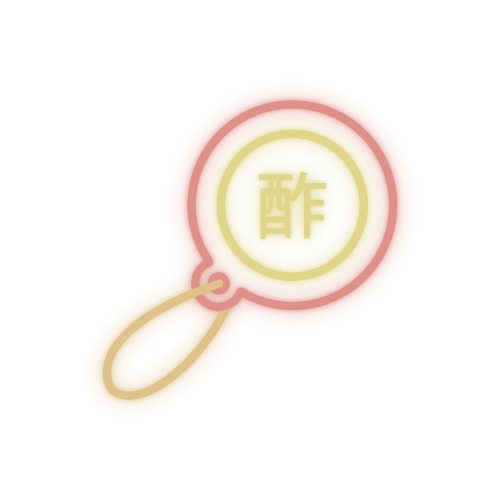

<!--Logo do projeto e titulo-->

<table >
<tr>
<td align="left" width="20%" valign="center">

</td>
<td><h1>Subazar</h1></td>
</tr>
</table>

<h1>Tecnologias usadas:</h1>
<table>
<tr>
<td align="left" width="60%" valign="center">
    
    
    
    
    
    
    
    
</td>
</tr>
</table>

